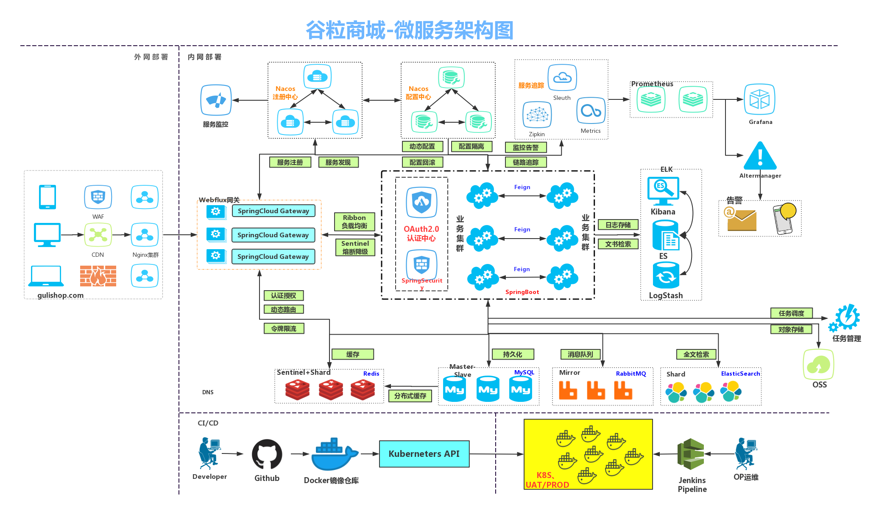

# 谷粒电商B2C

谷粒商城-微服务架构图



## 技术搭配分案
```lua

├── SpringCloud Alibaba Nacos 注册中心（服务发现|注册）
│
├── Spring Alibaba Nacos 配置中心（动态配置管理）
│   
├── SpringCloud Ribbon 负载均衡
│
├── SpringCloud OpenFeign 生命式HTTP客户端（调用远程服务）
│
├── SpringCloud Alibaba Sentinal 服务容错（限流、降级、熔断）-- 替代hystrix
│
├── SpringCloud Gateway API网关（webflux编程模式）
│
├── SpringCloud Sleuth 调用链监控
│
├── SpringCloud Alibaba Seata 分布式事务解决方案
│
└── 完
```

## 技术基础篇
### 1、分布式基础概念
微服务、注册中心、配置中心、远程调用、Feign、网关

### 2、基础开发
SpringBoot2.0、 SpringCloud、Mybatis-Plus、Vue组件化、阿里云对象存储

### 3、环境
Vagrant、Linux、Docker、Mysql、Redis、逆向工程&人人开源

### 4、开发规范
数据校验JSR303、全局异常处理、全局统一返回、全局跨域处理
枚举状态、业务状态码、VO与TO与PO划分、逻辑删除
Lombok：@Data、@Slf4j


## 解决跨域问题
1、使用nginx部署同一个域（不适合开发期间）

2、配置当次请求允许跨域（开发期间使用）
  添加响应头


